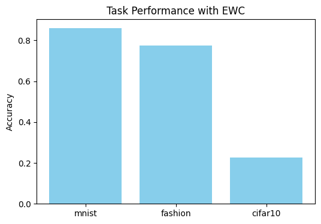

# lifelong-learning-continual-ai
A demo of Elastic Weight Consolidation for Lifelong Learning on MNIST, FashionMNIST, and CIFAR10

### 🧠 Why Lifelong Learning Matters
Traditional neural networks forget previous knowledge when trained on new tasks (catastrophic forgetting). **Lifelong learning** aims to retain old knowledge while learning new tasks, making AI systems more adaptive and intelligent.

This project demonstrates **Elastic Weight Consolidation (EWC)** as a solution for catastrophic forgetting using a simple neural network model.

---

### ✅ Features
- **Tasks:** MNIST → FashionMNIST → CIFAR10 (converted to grayscale)
- **Method:** EWC to prevent catastrophic forgetting
- **Platform:** Google Colab for quick execution

---

### 📈 Results
| Task       | Accuracy |
|------------|----------|
| MNIST      | 86.0%    |
| FashionMNIST | 77.4% |
| CIFAR10    | 22.7%    |



### ⚙️ How to Run
**In Google Colab:**
- Open the notebook: `notebooks/lifelong_learning_experiment.ipynb`
- Run all cells

**Local (Optional):**
```bash
pip install -r requirements.txt
python run_experiment.py
